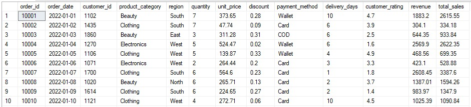
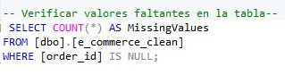
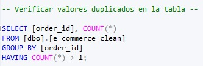
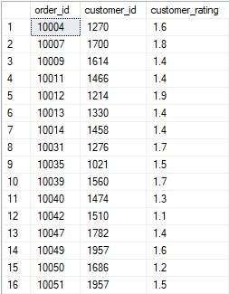

# Proyecto SQL: análisis de ventas de un e-commerce
## Resumen (Overview)
Un e-commerce busca mejorar su servicio y brindar un mejor servicio a sus clientes. Mi objetivo utilizar SQL Server Management Studio para analizar los datos para obtener recomendaciones para mejorar el servicio del e-commerce.


## Estructura del Proyecto
- Sobre los Datos
- Tareas
- Limpieza de Datos
- Análisis Exploratorio de Datos e Insights

## Sobre los Datos
Los datos originales con la información de cada columna se encuentra [aquí](https://www.kaggle.com/datasets/abbas829/e-commerce-sales-analytics-dataset?resource=download). 

El conjunto de datos consta de 5.000 registros con las siguientes columnas:
- Order_id: Un identificador único para cada pedido.
- Order_date: La fecha en que se realizó el pedido.
- Customer_id: Un identificador único para el cliente que realizó el pedido.
- Product_category: La categoría del producto vendido (por ejemplo, Belleza, Ropa, Electrónica).
- Region: La región geográfica donde se realizó el pedido (por ejemplo, Sur, Este, Oeste).
- Quantity: El número de artículos comprados en el pedido.
- Unit_price: El precio de una sola unidad del producto.
- Discount: El descuento aplicado al pedido (expresado como un número decimal).
- Payment_method: El método utilizado para el pago (por ejemplo, monedero electrónico, tarjeta, contra reembolso).
- Delivery_days: El número de días que tarda en entregarse el pedido.
- Customer_rating: La calificación otorgada por el cliente al pedido (en una escala del 1 al 5).
- Revenue: Los ingresos totales generados por el pedido (calculados como quantity * unit_price * (1 - discount)).
- Total_sales: Son los ingresos totales del pedido que consite en la multiplicacion de quantity con unit_price. Sin aplicar el descuento.



## Tareas (Task)

1. Rentabilidad por categoría: ¿Qué línea de producto genera el mayor volumen de efectivo real y vende mayor cantidad de productos?
2. Popularidad de métodos de pago: ¿Cuál es el método de pago más usado al realizar las compras?
3. Evaluación de la eficiencia logística regional: ¿Cuál es el tiempo promedio de las entregas en cada región?
4. Ranking de satisfacción general: ¿Cuál es el promedio de la clasificación del cliente en general?
5. Clientes más activos: ¿Quiénes son clientes que compran la mayor cantidad de productos?
6. Ranking de categoría estrella por región: ¿Cuál es la categoría que genera mayor ingreso en cada región?
7. Identificación de clientes con ratings críticos: ¿Quiénes son los clientes que calificaron con un puntaje bajo a los productos? 
8. Detección de anomalías logísticas: ¿Cuáles son los pedidos que tardaron el doble del promedio de su región?
9. Categorías con mejor calificación: ¿Cuál es el promedio de la clasificación de los clientes sobre cada categoría?
10. Segmentación de clientes por nivel de gasto: ¿Cómo se podría clasificar a los clientes en tres categorías (Platinum, Gold y Silver) en base a la cantidad de dinero que ponen cuando realizan sus compras?


## Limpieza de Datos
Se tiene que realizar limpieza de datos para que los datos esten limpios y listos antes del analisis. 






## Análisis Exploratorio de Datos (EDA) e Insights

#### Pregunta #1: ¿Qué línea de producto genera el mayor volumen de efectivo real y que vende mayor cantidad de productos?


```
SELECT 
    product_category,
    SUM(quantity) AS total_units_sold,
    SUM(revenue) AS total_revenue
FROM e_commerce_clean
GROUP BY product_category
ORDER BY total_revenue DESC;

```
Se identifico las categorías de productos, luego se realizo una suma total de quantity y revenue de cada categoría. Con el objetivo de obtener la cantidad total del efectivo y el total de artículos comprados en cada categoría. 
Se pudo encontrar que la categoría que genera el mayor volumen de efectivo real y que vende mayor cantidad de productos es Electronics. 
La empresa podría priorizar y ampliar el catálogo la categoría Electronics.


#### Pregunta #2: ¿Cuál es el método de pago más usado al realizar las compras?


```
SELECT 
    payment_method, 
    COUNT(order_id) AS transaction_count
FROM e_commerce_clean
GROUP BY payment_method
ORDER BY transaction_count desc;

```
 

Para realizar compras la tienda cuenta con diversos métodos de pago, para saber cual es el más usado, se realizó un conteo de orden_id para obtener transaction_count.
El método de pago más usado al realizar compras es mediante tarjeta (card).
Con esta información la empresa podría mantener el método de pago en la tienda, asimismo podría mejorar la experiencia de compra mediante tarjeta.


#### Pregunta #3: ¿Cuál es el tiempo promedio de las entregas en cada región?


```
SELECT 
    region, 
    AVG(delivery_days) AS avg_delivery_time
FROM e_commerce_clean
GROUP BY region
ORDER BY avg_delivery_time DESC;

```


Se especifico el apartado de región y se determino el promedio de delivery_days, dicho promedio se nombró como avg_delivery_time. Ademas, con ORDER BY se ordeno de mayor a menor.
Se consiguió identificar el promedio de South, North, East y West. 
Esta información podría ayudar a la empresa para poder identificar el tiempo promedio de entrega a las regiones. Asimismo, basándose en el promedio actual podrían tomar medidas para reducir los días para lograr un promedio de entregas en menos días, logrando así una mayor eficiencia en las entregas a un largo plazo.


#### Pregunta #4: ¿Cuál es el promedio de la clasificación del cliente en general?


```
SELECT AVG(customer_rating) AS global_rating
FROM e_commerce_clean;


```


Para encontrar el promedio de customer_rating se utilizo AVG, el promedio se nombró como global_rating.
El promedio de la clasificación del cliente en general es de 2.97398.
El resultado muestra que la empresa no tiene una clasificación destacada, por lo cual la empresa puede usar esta información para priorizar mejorar el servicio para los clientes. 


#### Pregunta #5: ¿Quiénes son los 10 clientes que compran la mayor cantidad de productos?


```
with mejores_clientes as (
select TOP 10
      sum([quantity]) as 'Productos_vendidos',
      [customer_id] from [dbo].[e_commerce_clean]
where [quantity]> 0
group by [customer_id]
order by sum([quantity]) desc
)

select * 
from mejores_clientes;
```


Customer_id sirve para identificar al cliente, se realizó una suma en el apartado de quantity para saber cuántos productos fueron comprados por cada cliente. Se uso Top 10 para identificar a los 10 clientes que compran más productos. 
Se pudo encontrar a los 10 clientes que compraron mayor cantidad de productos, identificándolos con el customer_id estos clientes tienen los números 1663, 1957, 1675, 1935, 1276, 1038, 1267, 1496, 1775 y 1117.
Con esta información la empresa puede brindar un descuento especial o algún cupón a los clientes que realizan más compras. Con el objetivo de fidelizar a los clientes y siga prefiriendo comprar en la tienda oline. 


#### Pregunta #6: ¿Cuál es la categoría que genera mayor ingreso en cada región?


```
WITH RegionalRanking AS (
    SELECT 
        region,
        product_category,
        SUM(revenue) AS total_revenue,
        RANK() OVER (PARTITION BY region ORDER BY SUM(revenue) DESC) as pos
    FROM e_commerce_clean
    GROUP BY region, product_category
)
SELECT region, product_category, total_revenue
FROM RegionalRanking
WHERE pos = 1
ORDER BY total_revenue desc;


```


Se realizo una suma de los ingresos de cada región y luego se encontró cual es la categoría mas vendida en cada una. Luego se ordeno de mayor a menor.
Se descubrió que la categoría que genera mayor ingreso en cada región es la categoría de electrónicos. 
Por lo cual, la empresa podría priorizar y ofrecer más productos de la categoría de electrónicos al ser la categoría mas popular en todas las regiones.


#### Pregunta #7: ¿Quiénes son los clientes que calificaron con un puntaje bajo a los productos? 

```
SELECT order_id, customer_id, customer_rating
FROM e_commerce_clean
WHERE customer_rating < 2.0;
```



Para identificar los clientes se usa el customer_id, para identificar el pedido está el orden_id y para identificar la clasificación del cliente esta el customer_rating. En where se dio la especificación de que en el apartado de customer_rating se muestren las clasificaciones menores a 2, los cuales serían clasificaciones bajas.
Se encontró que pedidos y que clientes clasificaron con un bajo puntaje a los productos.
La empresa podría comunicarse con los clientes para buscar una respuesta en concreta sobre la razón de la clasificación para de esa forma mejorar para futuros pedidos.


#### Pregunta #8:  ¿Cuáles son los pedidos que tardaron el doble del promedio de su región?


```
SELECT order_id, region, delivery_days,
AVG(delivery_days) OVER(PARTITION BY region) AS regional_avg
FROM e_commerce_clean
WHERE delivery_days > (SELECT AVG(delivery_days) * 2
FROM e_commerce_clean);

```


Se determino el promedio de delivery_days en cada region y en where se multiplico con 2 el promedio de delivery_days. Con el objetivo que en la tabla se muestren los pedidos que tardaron el doble del promedio su región. 
Se descubrió que no hay ningún pedido que tardara el doble del promedio de su región. Por lo cual se puede concluir que la empresa no cuenta con tardanza excesiva en sus pedidos. Se puede determinar que la empresa no tiene problemas respecto a la entrega de sus pedidos. La empresa podría asegurar a sus clientes que los pedidos no demoraran muchos días en su entrega, lo que generaría confianza en los clientes al saber que el pedido llegara siempre en un tiempo moderado. 


#### Pregunta #9: ¿Cuál es el promedio de la clasificación de los clientes sobre cada categoría?


```
SELECT product_category, ROUND(AVG(customer_rating), 2) AS avg_rating
FROM e_commerce_clean
GROUP BY product_category
ORDER BY avg_rating DESC;


```


En select se puso product_category, saco un promedio de customer_rating y con orden by se ordeno de mayor a menor. Se encontro que el promedio de clasificaciones de cada categoría dando como resultado que Clothing tenga 3.01, Beauty tenga 3.01, Electronics tenga 2.95 y Home tenga 2.94.
Los resultados muestran que en cada categoría los clientes no dan una alta clasificación, por lo cual la empresa podría tomar medidas como preguntar a los clientes al respecto y encontrar la razón por la cual las clasificaciones no son muy altas. Al encontrar el problema, la empresa podría resolverlo y de esa manera las clasificaciones por parte de los clientes podrían ser mucho mas altas. 


#### Pregunta #10: ¿Cómo se podría clasificar a los clientes en tres categorías (Platinum, Gold y Silver) en base a la cantidad de dinero que ponen cuando realizan sus compras?

```
SELECT 
    customer_id, 
    SUM(revenue) AS total_spent,
    CASE 
        WHEN SUM(revenue) > 3000 THEN 'Platinum'
        WHEN SUM(revenue) BETWEEN 1500 AND 3000 THEN 'Gold'
        ELSE 'Silver'
    END AS customer_segment
FROM e_commerce_clean
GROUP BY customer_id;

```


Se realiza la suma de revenue y se crean 3 categorias que se diferencian dependiendo de la cantidad de dinero. Platinum es cuando el monto es mayor a 3000, Gold es cuando el monto esta entre 1500 y 3000, y Silver vendría a ser el resto.  Además, se identifica cual seria el monto de cada customer_id. 
La empresa mediante esta clasificación puede ofrecer promociones a los clientes dependiendo de su categoría, Platinum al ser el más alto residiría mejores promociones. 


## Conclusión

#### Clientes estratégicos: 
El grupo de clientes que realizan compras que generan mayores ingresos a la empresa, se podría brindar promociones o ofertas para lograr fidelizarlos. 
#### Eficiencia logística regional:  
El tiempo promedio de las entregas por región, no excede los 7 días. Además, no hay ningún pedido que tarde el doble del promedio de cada región. El tiempo de entregas no cuenta con una excesiva tardanza en sus entregas. 
#### Rentabilidad por categoría: 
La categoría de Electronics genera mayor ingreso a la empresa.La empresa podría agregar más productos y mantener en constante restablecimiento el stock de esta categoría al ser la más popular.
#### Calificación general: 
La calificación otorgada por el cliente al pedido es un promedio de 2.97, la empresa debería mejorar en este apartado para que en un futuro pueda obtener una calificación destacada.


