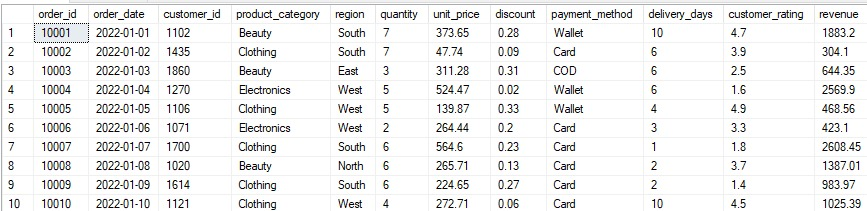

# Proyecto SQL: análisis de ventas de un e-commerce
## Resumen (Overview)
Un e-commerce busca mejorar su servicio y brindar un mejor servicio a sus clientes. Mi objetivo utilizar SQL Server Management Studio para analizar los datos para obtener recomendaciones para mejorar el servicio del e-commerce.


## Estructura del Proyecto
- Sobre los Datos
- Tareas
- Limpieza de Datos
- Análisis Exploratorio de Datos e Insights

## Sobre los Datos
Los datos originales con la información de cada columna se encuentra [aquí](https://www.kaggle.com/datasets/abbas829/e-commerce-sales-analytics-dataset?resource=download). 

El conjunto de datos consta de 5.000 registros con las siguientes columnas:
order_id: Un identificador único para cada pedido.
-Order_date: La fecha en que se realizó el pedido.
- Customer_id: Un identificador único para el cliente que realizó el pedido.
- Product_category: La categoría del producto vendido (por ejemplo, Belleza, Ropa, Electrónica).
- Region: La región geográfica donde se realizó el pedido (por ejemplo, Sur, Este, Oeste).
- Quantity: El número de artículos comprados en el pedido.
- Unit_price: El precio de una sola unidad del producto.
- Discount: El descuento aplicado al pedido (expresado como un número decimal).
- Payment_method: El método utilizado para el pago (por ejemplo, monedero electrónico, tarjeta, contra reembolso).
- Delivery_days: El número de días que tarda en entregarse el pedido.
- Customer_rating: La calificación otorgada por el cliente al pedido (en una escala del 1 al 5).
- Revenue: Los ingresos totales generados por el pedido (calculados como quantity * unit_price * (1 - discount)).



## Tareas (Task)

Rentabilidad por Categoría: ¿Qué línea de producto genera el mayor volumen de efectivo real?


## Limpieza de Datos
Se tiene que realizar limpieza de datos para que los datos esten limpios y listos antes del analisis. 


## Análisis Exploratorio de Datos (EDA) e Insights

Pregunta #1: ¿Qué línea de producto genera el mayor volumen de efectivo real y mayor cantidad de productos?


```
SELECT 
    product_category,
    SUM(quantity) AS total_units_sold,
    SUM(revenue) AS total_revenue
FROM e_commerce_clean
GROUP BY product_category
ORDER BY total_revenue DESC;

```


## Conclusion


